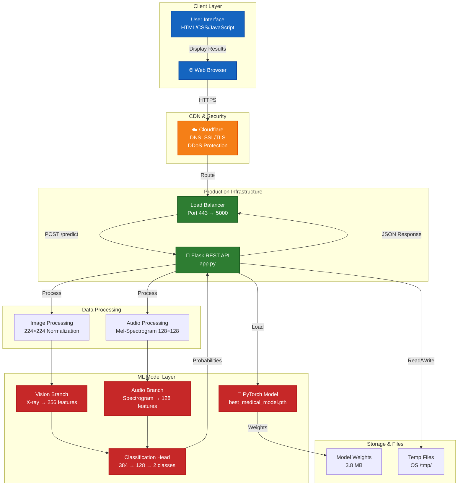
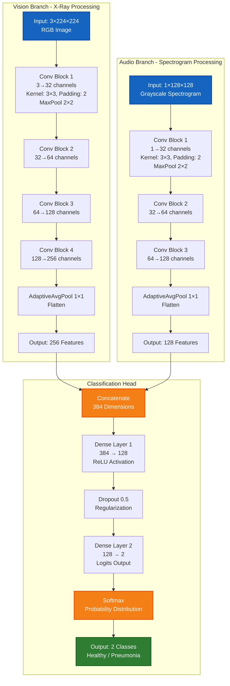
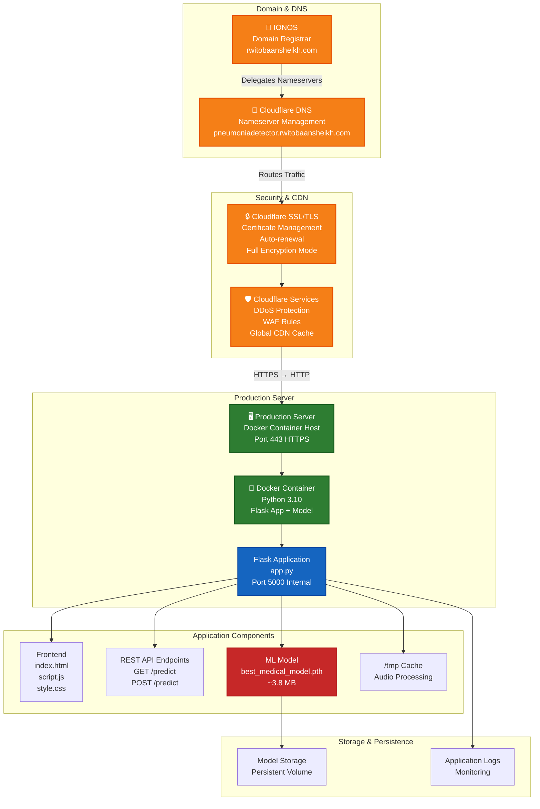
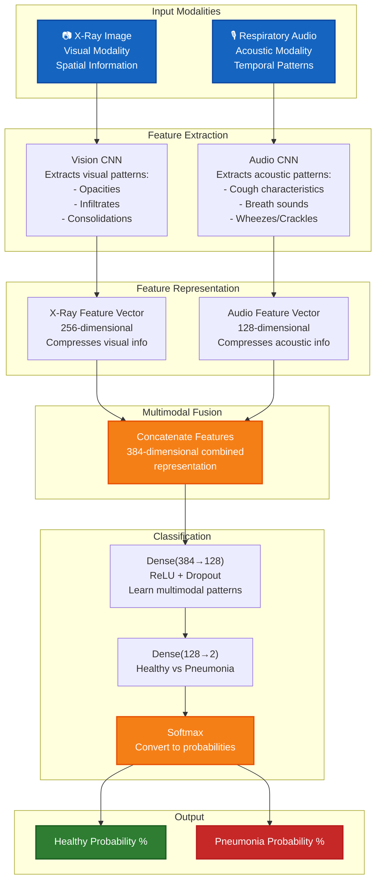
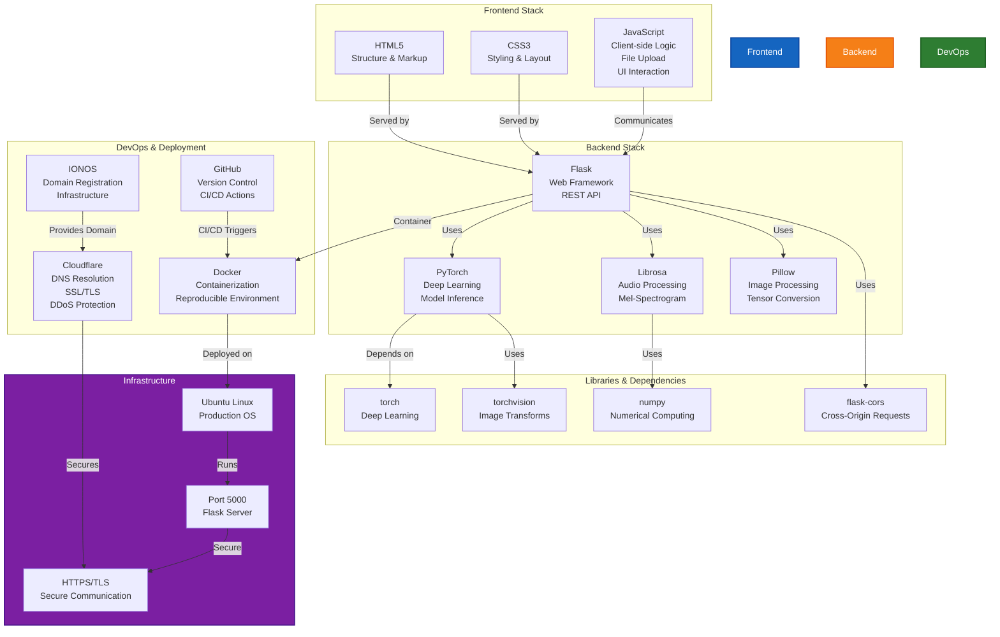

# PneumoScan AI - Architecture Diagrams

This document contains comprehensive architecture diagrams for the Pneumonia Detector application.

---

## 1. System Architecture Overview



---

## 2. Detailed Data Flow Pipeline

```mermaid
graph LR
    subgraph "Input Stage"
        XRayFile["📷 X-Ray Image<br/>Any Format/Size"]
        AudioFile["🎙️ Audio File<br/>Any Format"]
    end
    
    subgraph "Frontend Processing"
        Upload["File Upload Form<br/>index.html"]
        Preview["Live Preview<br/>script.js"]
    end
    
    subgraph "Network"
        HTTPS["HTTPS POST<br/>/predict"]
    end
    
    subgraph "Backend Preprocessing"
        XRayStep1["Load Image<br/>PIL.Image.open"]
        XRayStep2["Resize → 224×224<br/>Normalize ImageNet Stats"]
        XRayStep3["Convert → RGB Tensor<br/>1×3×224×224"]
        
        AudioStep1["Load Audio<br/>librosa.load"]
        AudioStep2["Pad/Trim → 3 sec<br/>Generate Mel-Spectrogram"]
        AudioStep3["Normalize & Resize<br/>→ 128×128 Grayscale"]
        AudioStep4["Convert → Tensor<br/>1×1×128×128"]
    end
    
    subgraph "Model Inference"
        VisionFwd["Vision Branch<br/>4 Conv Blocks<br/>→ 256 Features"]
        AudioFwd["Audio Branch<br/>3 Conv Blocks<br/>→ 128 Features"]
        Concat["Concatenate<br/>384 Dimensions"]
        ClassifyFwd["Classification Head<br/>384→128→2"]
        Softmax["Softmax<br/>Probabilities"]
    end
    
    subgraph "Output Stage"
        Results["JSON Response<br/>Healthy %, Pneumonia %"]
        Display["Display Results<br/>Color-coded on UI"]
    end
    
    XRayFile --> Upload
    AudioFile --> Upload
    Upload --> Preview
    Preview --> HTTPS
    
    HTTPS --> XRayStep1
    HTTPS --> AudioStep1
    
    XRayStep1 --> XRayStep2
    XRayStep2 --> XRayStep3
    XRayStep3 --> VisionFwd
    
    AudioStep1 --> AudioStep2
    AudioStep2 --> AudioStep3
    AudioStep3 --> AudioStep4
    AudioStep4 --> AudioFwd
    
    VisionFwd --> Concat
    AudioFwd --> Concat
    
    Concat --> ClassifyFwd
    ClassifyFwd --> Softmax
    
    Softmax --> Results
    Results --> Display
    
    style XRayFile fill:#1565c0,color:#fff,stroke:#0d47a1,stroke-width:2px
    style AudioFile fill:#1565c0,color:#fff,stroke:#0d47a1,stroke-width:2px
    style Results fill:#2e7d32,color:#fff,stroke:#1b5e20,stroke-width:2px
    style Display fill:#2e7d32,color:#fff,stroke:#1b5e20,stroke-width:2px
    style Softmax fill:#f57f17,color:#fff,stroke:#e65100,stroke-width:2px
    style Concat fill:#f57f17,color:#fff,stroke:#e65100,stroke-width:2px
```



---

## 3. Model Architecture in Detail



---

## 4. Deployment Architecture



---

## 5. CI/CD Pipeline Architecture

```mermaid
graph LR
    subgraph "Development"
        Dev["👨‍💻 Developer<br/>Local Machine"]
        Code["Source Code<br/>Python/HTML/JS/CSS"]
        Test["Local Testing<br/>http://localhost:5000"]
    end
    
    subgraph "Version Control"
        Git["Git Repository<br/>GitHub<br/>Main Branch"]
        Trigger["📢 Push Event<br/>Webhook Trigger"]
    end
    
    subgraph "CI/CD Pipeline - GitHub Actions"
        GHActions["⚙️ GitHub Actions Runner<br/>ubuntu-latest"]
        Checkout["Step 1: Checkout Code<br/>git clone"]
        Build["Step 2: Build Docker<br/>docker build"]
        Test_CI["Step 3: Run Tests<br/>Unit Tests<br/>Lint Checks"]
        Registry["Step 4: Push Image<br/>Container Registry<br/>ECR/Docker Hub"]
    end
    
    subgraph "Deployment"
        Deploy["Step 5: SSH Deploy<br/>Connect to Prod Server"]
        PullImage["Step 6: Pull Latest Image<br/>docker-compose pull"]
        Update["Step 7: Update Container<br/>docker-compose up -d"]
        Health["Step 8: Health Check<br/>Verify App Running"]
    end
    
    subgraph "Production - Live"
        Prod["🌐 Production Server<br/>https://pneumoniadetector.rwitobaansheikh.com/"]
        Users["👥 Users<br/>Access Application"]
        Monitor["📊 Monitoring<br/>Uptime & Performance"]
    end
    
    Dev -->|Code Changes| Code
    Code -->|git push| Git
    Git -->|Webhook| Trigger
    
    Trigger --> GHActions
    GHActions --> Checkout
    Checkout --> Build
    Build --> Test_CI
    Test_CI --> Registry
    Registry --> Deploy
    Deploy --> PullImage
    PullImage --> Update
    Update --> Health
    
    Health -->|Auto-rollback on failure| Git
    Health -->|Success| Prod
    
    Prod --> Users
    Prod --> Monitor
    
    style Dev fill:#2e7d32,color:#fff,stroke:#1b5e20,stroke-width:2px
    style Git fill:#1565c0,color:#fff,stroke:#0d47a1,stroke-width:2px
    style GHActions fill:#f57f17,color:#fff,stroke:#e65100,stroke-width:2px
    style Prod fill:#00796b,color:#fff,stroke:#004d40,stroke-width:2px
    style Users fill:#2e7d32,color:#fff,stroke:#1b5e20,stroke-width:2px
```



---

## 6. Multimodal Fusion Architecture



---

## 7. Technology Stack



---

## Key Architecture Features

### **Multimodal Design**
- Two separate CNN branches process different input modalities
- Early fusion approach: combine features after separate processing
- Complementary information from visual and acoustic domains

### **Scalability**
- Stateless Flask API allows horizontal scaling
- Container-based deployment supports load balancing
- Cloudflare CDN caching reduces backend load

### **Security**
- End-to-end HTTPS encryption via Cloudflare
- DDoS protection at CDN layer
- No sensitive data stored on disk
- Temporary files cleaned up after processing

### **Reliability**
- Automated deployment via GitHub Actions
- Health checks ensure application stability
- Zero-downtime deployments
- Automatic rollback on failure

### **Performance**
- Inference time: 2-5 seconds (CPU), <1 second (GPU)
- Lightweight model: ~3.8 MB
- Efficient image preprocessing pipeline
- Audio spectrograms computed on-demand

---

## File Organization

```
Webapp/
├── Frontend Layer
│   ├── index.html           (HTML markup)
│   ├── stylesheets/
│   │   └── style.css       (Styling)
│   └── script/
│       └── script.js       (Client logic)
│
├── Backend Layer
│   ├── app.py              (Flask REST API)
│   ├── model.py            (PyTorch architecture)
│   └── best_medical_model.pth (Model weights)
│
├── Deployment
│   ├── Dockerfile          (Container config)
│   ├── requirements.txt     (Dependencies)
│   ├── task-def.json       (ECS definition)
│   └── .github/workflows/  (CI/CD actions)
│
└── Documentation
    ├── README.md
    └── ARCHITECTURE.md     (This file)
```

---

**Last Updated**: February 21, 2026  
**Status**: Production Deployed  
**Live URL**: https://pneumoniadetector.rwitobaansheikh.com/
