# PneumoScan AI - Architecture Diagrams

This document contains comprehensive architecture diagrams for the Pneumonia Detector application.

---

## 1. System Architecture Overview

```mermaid
graph TB
    subgraph "Client Layer"
        Browser["🌐 Web Browser"]
        UI["User Interface<br/>HTML/CSS/JavaScript"]
    end
    
    subgraph "CDN & Security"
        Cloudflare["☁️ Cloudflare<br/>DNS, SSL/TLS<br/>DDoS Protection"]
    end
    
    subgraph "Production Infrastructure"
        LB["Load Balancer<br/>Port 443 → 5000"]
        API["🔧 Flask REST API<br/>app.py"]
    end
    
    subgraph "ML Model Layer"
        Model["🤖 PyTorch Model<br/>best_medical_model.pth"]
        VisionBranch["Vision Branch<br/>X-ray → 256 features"]
        AudioBranch["Audio Branch<br/>Spectrogram → 128 features"]
        Classifier["Classification Head<br/>384 → 128 → 2 classes"]
    end
    
    subgraph "Data Processing"
        ImgProc["Image Processing<br/>224×224 Normalization"]
        AudioProc["Audio Processing<br/>Mel-Spectrogram 128×128"]
    end
    
    subgraph "Storage & Files"
        ModelFile["Model Weights<br/>3.8 MB"]
        TempFiles["Temp Files<br/>OS /tmp/"]
    end
    
    Browser -->|HTTPS| Cloudflare
    Cloudflare -->|Route| LB
    LB -->|POST /predict| API
    UI -->|Display Results| Browser
    
    API -->|Load| Model
    API -->|Process| ImgProc
    API -->|Process| AudioProc
    
    ImgProc --> VisionBranch
    AudioProc --> AudioBranch
    
    VisionBranch --> Classifier
    AudioBranch --> Classifier
    
    Model -->|Weights| ModelFile
    API -->|Read/Write| TempFiles
    
    Classifier -->|Probabilities| API
    API -->|JSON Response| LB
    
    style Browser fill:#1565c0,color:#fff,stroke:#0d47a1,stroke-width:2px
    style UI fill:#1565c0,color:#fff,stroke:#0d47a1,stroke-width:2px
    style Cloudflare fill:#f57f17,color:#fff,stroke:#e65100,stroke-width:2px
    style LB fill:#2e7d32,color:#fff,stroke:#1b5e20,stroke-width:2px
    style API fill:#2e7d32,color:#fff,stroke:#1b5e20,stroke-width:2px
    style Model fill:#c62828,color:#fff,stroke:#b71c1c,stroke-width:2px
    style VisionBranch fill:#c62828,color:#fff,stroke:#b71c1c,stroke-width:2px
    style AudioBranch fill:#c62828,color:#fff,stroke:#b71c1c,stroke-width:2px
    style Classifier fill:#c62828,color:#fff,stroke:#b71c1c,stroke-width:2px
```



---

## 2. Detailed Data Flow Pipeline

```mermaid
graph LR
    subgraph "Input Stage"
        XRayFile["📷 X-Ray Image<br/>Any Format/Size"]
        AudioFile["🎙️ Audio File<br/>Any Format"]
    end
    
    subgraph "Frontend Processing"
        Upload["File Upload Form<br/>index.html"]
        Preview["Live Preview<br/>script.js"]
    end
    
    subgraph "Network"
        HTTPS["HTTPS POST<br/>/predict"]
    end
    
    subgraph "Backend Preprocessing"
        XRayStep1["Load Image<br/>PIL.Image.open"]
        XRayStep2["Resize → 224×224<br/>Normalize ImageNet Stats"]
        XRayStep3["Convert → RGB Tensor<br/>1×3×224×224"]
        
        AudioStep1["Load Audio<br/>librosa.load"]
        AudioStep2["Pad/Trim → 3 sec<br/>Generate Mel-Spectrogram"]
        AudioStep3["Normalize & Resize<br/>→ 128×128 Grayscale"]
        AudioStep4["Convert → Tensor<br/>1×1×128×128"]
    end
    
    subgraph "Model Inference"
        VisionFwd["Vision Branch<br/>4 Conv Blocks<br/>→ 256 Features"]
        AudioFwd["Audio Branch<br/>3 Conv Blocks<br/>→ 128 Features"]
        Concat["Concatenate<br/>384 Dimensions"]
        ClassifyFwd["Classification Head<br/>384→128→2"]
        Softmax["Softmax<br/>Probabilities"]
    end
    
    subgraph "Output Stage"
        Results["JSON Response<br/>Healthy %, Pneumonia %"]
        Display["Display Results<br/>Color-coded on UI"]
    end
    
    XRayFile --> Upload
    AudioFile --> Upload
    Upload --> Preview
    Preview --> HTTPS
    
    HTTPS --> XRayStep1
    HTTPS --> AudioStep1
    
    XRayStep1 --> XRayStep2
    XRayStep2 --> XRayStep3
    XRayStep3 --> VisionFwd
    
    AudioStep1 --> AudioStep2
    AudioStep2 --> AudioStep3
    AudioStep3 --> AudioStep4
    AudioStep4 --> AudioFwd
    
    VisionFwd --> Concat
    AudioFwd --> Concat
    
    Concat --> ClassifyFwd
    ClassifyFwd --> Softmax
    
    Softmax --> Results
    Results --> Display
    
    style XRayFile fill:#1565c0,color:#fff,stroke:#0d47a1,stroke-width:2px
    style AudioFile fill:#1565c0,color:#fff,stroke:#0d47a1,stroke-width:2px
    style Results fill:#2e7d32,color:#fff,stroke:#1b5e20,stroke-width:2px
    style Display fill:#2e7d32,color:#fff,stroke:#1b5e20,stroke-width:2px
    style Softmax fill:#f57f17,color:#fff,stroke:#e65100,stroke-width:2px
    style Concat fill:#f57f17,color:#fff,stroke:#e65100,stroke-width:2px
```



---

## 3. Model Architecture in Detail

```mermaid
graph TD
    subgraph "Vision Branch - X-Ray Processing"
        V0["Input: 3×224×224<br/>RGB Image"]
        V1["Conv Block 1<br/>3→32 channels<br/>Kernel: 3×3, Padding: 2<br/>MaxPool 2×2"]
        V2["Conv Block 2<br/>32→64 channels"]
        V3["Conv Block 3<br/>64→128 channels"]
        V4["Conv Block 4<br/>128→256 channels"]
        V5["AdaptiveAvgPool 1×1<br/>Flatten"]
        V_Out["Output: 256 Features"]
    end
    
    subgraph "Audio Branch - Spectrogram Processing"
        A0["Input: 1×128×128<br/>Grayscale Spectrogram"]
        A1["Conv Block 1<br/>1→32 channels<br/>Kernel: 3×3, Padding: 2<br/>MaxPool 2×2"]
        A2["Conv Block 2<br/>32→64 channels"]
        A3["Conv Block 3<br/>64→128 channels"]
        A4["AdaptiveAvgPool 1×1<br/>Flatten"]
        A_Out["Output: 128 Features"]
    end
    
    subgraph "Classification Head"
        Concat["Concatenate<br/>384 Dimensions"]
        FC1["Dense Layer 1<br/>384 → 128<br/>ReLU Activation"]
        Drop["Dropout 0.5<br/>Regularization"]
        FC2["Dense Layer 2<br/>128 → 2<br/>Logits Output"]
        Softmax["Softmax<br/>Probability Distribution"]
        Out["Output: 2 Classes<br/>Healthy / Pneumonia"]
    end
    
    V0 --> V1 --> V2 --> V3 --> V4 --> V5 --> V_Out
    A0 --> A1 --> A2 --> A3 --> A4 --> A_Out
    
    V_Out --> Concat
    A_Out --> Concat
    Concat --> FC1 --> Drop --> FC2 --> Softmax --> Out
    
    style V0 fill:#1565c0,color:#fff,stroke:#0d47a1,stroke-width:2px
    style A0 fill:#1565c0,color:#fff,stroke:#0d47a1,stroke-width:2px
    style Concat fill:#f57f17,color:#fff,stroke:#e65100,stroke-width:2px
    style Out fill:#2e7d32,color:#fff,stroke:#1b5e20,stroke-width:2px
    style Softmax fill:#f57f17,color:#fff,stroke:#e65100,stroke-width:2px
```



---

## 4. Deployment Architecture

```mermaid
graph TB
    subgraph "Domain & DNS"
        IONOS["🏢 IONOS<br/>Domain Registrar<br/>rwitobaansheikh.com"]
        CF_DNS["📍 Cloudflare DNS<br/>Nameserver Management<br/>pneumoniadetector.rwitobaansheikh.com"]
    end
    
    subgraph "Security & CDN"
        CF_SSL["🔒 Cloudflare SSL/TLS<br/>Certificate Management<br/>Auto-renewal<br/>Full Encryption Mode"]
        CF_DDoS["🛡️ Cloudflare Services<br/>DDoS Protection<br/>WAF Rules<br/>Global CDN Cache"]
    end
    
    subgraph "Production Server"
        Server["🖥️ Production Server<br/>Docker Container Host<br/>Port 443 HTTPS"]
        Docker["🐳 Docker Container<br/>Python 3.10<br/>Flask App + Model"]
        App["Flask Application<br/>app.py<br/>Port 5000 Internal"]
    end
    
    subgraph "Application Components"
        WebUI["Frontend<br/>index.html<br/>script.js<br/>style.css"]
        API["REST API Endpoints<br/>GET /predict<br/>POST /predict"]
        Model["ML Model<br/>best_medical_model.pth<br/>~3.8 MB"]
        Cache["/tmp Cache<br/>Audio Processing"]
    end
    
    subgraph "Storage & Persistence"
        ModelStore["Model Storage<br/>Persistent Volume"]
        Logs["Application Logs<br/>Monitoring"]
    end
    
    IONOS -->|Delegates Nameservers| CF_DNS
    CF_DNS -->|Routes Traffic| CF_SSL
    CF_SSL --> CF_DDoS
    CF_DDoS -->|HTTPS → HTTP| Server
    
    Server --> Docker
    Docker --> App
    
    App --> WebUI
    App --> API
    App --> Model
    App --> Cache
    
    Model --> ModelStore
    App --> Logs
    
    style IONOS fill:#f57f17,color:#fff,stroke:#e65100,stroke-width:2px
    style CF_DNS fill:#f57f17,color:#fff,stroke:#e65100,stroke-width:2px
    style CF_SSL fill:#f57f17,color:#fff,stroke:#e65100,stroke-width:2px
    style CF_DDoS fill:#f57f17,color:#fff,stroke:#e65100,stroke-width:2px
    style Server fill:#2e7d32,color:#fff,stroke:#1b5e20,stroke-width:2px
    style Docker fill:#2e7d32,color:#fff,stroke:#1b5e20,stroke-width:2px
    style App fill:#1565c0,color:#fff,stroke:#0d47a1,stroke-width:2px
    style Model fill:#c62828,color:#fff,stroke:#b71c1c,stroke-width:2px
```



---

## 5. CI/CD Pipeline Architecture

```mermaid
graph LR
    subgraph "Development"
        Dev["👨‍💻 Developer<br/>Local Machine"]
        Code["Source Code<br/>Python/HTML/JS/CSS"]
        Test["Local Testing<br/>http://localhost:5000"]
    end
    
    subgraph "Version Control"
        Git["Git Repository<br/>GitHub<br/>Main Branch"]
        Trigger["📢 Push Event<br/>Webhook Trigger"]
    end
    
    subgraph "CI/CD Pipeline - GitHub Actions"
        GHActions["⚙️ GitHub Actions Runner<br/>ubuntu-latest"]
        Checkout["Step 1: Checkout Code<br/>git clone"]
        Build["Step 2: Build Docker<br/>docker build"]
        Test_CI["Step 3: Run Tests<br/>Unit Tests<br/>Lint Checks"]
        Registry["Step 4: Push Image<br/>Container Registry<br/>ECR/Docker Hub"]
    end
    
    subgraph "Deployment"
        Deploy["Step 5: SSH Deploy<br/>Connect to Prod Server"]
        PullImage["Step 6: Pull Latest Image<br/>docker-compose pull"]
        Update["Step 7: Update Container<br/>docker-compose up -d"]
        Health["Step 8: Health Check<br/>Verify App Running"]
    end
    
    subgraph "Production - Live"
        Prod["🌐 Production Server<br/>https://pneumoniadetector.rwitobaansheikh.com/"]
        Users["👥 Users<br/>Access Application"]
        Monitor["📊 Monitoring<br/>Uptime & Performance"]
    end
    
    Dev -->|Code Changes| Code
    Code -->|git push| Git
    Git -->|Webhook| Trigger
    
    Trigger --> GHActions
    GHActions --> Checkout
    Checkout --> Build
    Build --> Test_CI
    Test_CI --> Registry
    Registry --> Deploy
    Deploy --> PullImage
    PullImage --> Update
    Update --> Health
    
    Health -->|Auto-rollback on failure| Git
    Health -->|Success| Prod
    
    Prod --> Users
    Prod --> Monitor
    
    style Dev fill:#2e7d32,color:#fff,stroke:#1b5e20,stroke-width:2px
    style Git fill:#1565c0,color:#fff,stroke:#0d47a1,stroke-width:2px
    style GHActions fill:#f57f17,color:#fff,stroke:#e65100,stroke-width:2px
    style Prod fill:#00796b,color:#fff,stroke:#004d40,stroke-width:2px
    style Users fill:#2e7d32,color:#fff,stroke:#1b5e20,stroke-width:2px
```



---

## 6. Multimodal Fusion Architecture

```mermaid
graph TB
    subgraph "Input Modalities"
        XRay["📷 X-Ray Image<br/>Visual Modality<br/>Spatial Information"]
        Audio["🎙️ Respiratory Audio<br/>Acoustic Modality<br/>Temporal Patterns"]
    end
    
    subgraph "Feature Extraction"
        XRayFeat["Vision CNN<br/>Extracts visual patterns:<br/>- Opacities<br/>- Infiltrates<br/>- Consolidations"]
        AudioFeat["Audio CNN<br/>Extracts acoustic patterns:<br/>- Cough characteristics<br/>- Breath sounds<br/>- Wheezes/Crackles"]
    end
    
    subgraph "Feature Representation"
        XRayVec["X-Ray Feature Vector<br/>256-dimensional<br/>Compresses visual info"]
        AudioVec["Audio Feature Vector<br/>128-dimensional<br/>Compresses acoustic info"]
    end
    
    subgraph "Multimodal Fusion"
        Fusion["Concatenate Features<br/>384-dimensional combined<br/>representation"]
    end
    
    subgraph "Classification"
        Dense1["Dense(384→128)<br/>ReLU + Dropout<br/>Learn multimodal patterns"]
        Dense2["Dense(128→2)<br/>Healthy vs Pneumonia"]
        Probs["Softmax<br/>Convert to probabilities"]
    end
    
    subgraph "Output"
        HealthyProb["Healthy Probability %"]
        PneumoniaProb["Pneumonia Probability %"]
    end
    
    XRay --> XRayFeat --> XRayVec
    Audio --> AudioFeat --> AudioVec
    
    XRayVec --> Fusion
    AudioVec --> Fusion
    
    Fusion --> Dense1 --> Dense2 --> Probs
    
    Probs --> HealthyProb
    Probs --> PneumoniaProb
    
    style XRay fill:#1565c0,color:#fff,stroke:#0d47a1,stroke-width:2px
    style Audio fill:#1565c0,color:#fff,stroke:#0d47a1,stroke-width:2px
    style Fusion fill:#f57f17,color:#fff,stroke:#e65100,stroke-width:2px
    style Probs fill:#f57f17,color:#fff,stroke:#e65100,stroke-width:2px
    style HealthyProb fill:#2e7d32,color:#fff,stroke:#1b5e20,stroke-width:2px
    style PneumoniaProb fill:#c62828,color:#fff,stroke:#b71c1c,stroke-width:2px
```



---

## 7. Technology Stack


---

## Key Architecture Features

### **Multimodal Design**
- Two separate CNN branches process different input modalities
- Early fusion approach: combine features after separate processing
- Complementary information from visual and acoustic domains

### **Scalability**
- Stateless Flask API allows horizontal scaling
- Container-based deployment supports load balancing
- Cloudflare CDN caching reduces backend load

### **Security**
- End-to-end HTTPS encryption via Cloudflare
- DDoS protection at CDN layer
- No sensitive data stored on disk
- Temporary files cleaned up after processing

### **Reliability**
- Automated deployment via GitHub Actions
- Health checks ensure application stability
- Zero-downtime deployments
- Automatic rollback on failure

### **Performance**
- Inference time: 2-5 seconds (CPU), <1 second (GPU)
- Lightweight model: ~3.8 MB
- Efficient image preprocessing pipeline
- Audio spectrograms computed on-demand

---

## File Organization

```
Webapp/
├── Frontend Layer
│   ├── index.html           (HTML markup)
│   ├── stylesheets/
│   │   └── style.css       (Styling)
│   └── script/
│       └── script.js       (Client logic)
│
├── Backend Layer
│   ├── app.py              (Flask REST API)
│   ├── model.py            (PyTorch architecture)
│   └── best_medical_model.pth (Model weights)
│
├── Deployment
│   ├── Dockerfile          (Container config)
│   ├── requirements.txt     (Dependencies)
│   ├── task-def.json       (ECS definition)
│   └── .github/workflows/  (CI/CD actions)
│
└── Documentation
    ├── README.md
    └── ARCHITECTURE.md     (This file)
```

---

**Last Updated**: February 21, 2026  
**Status**: Production Deployed  
**Live URL**: https://pneumoniadetector.rwitobaansheikh.com/
